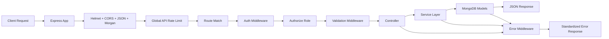
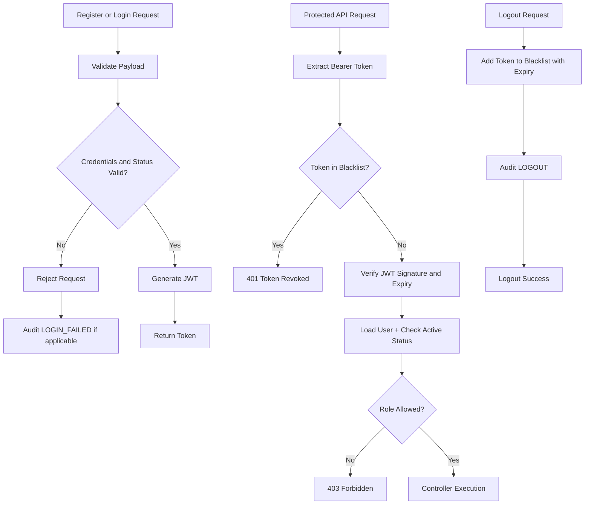
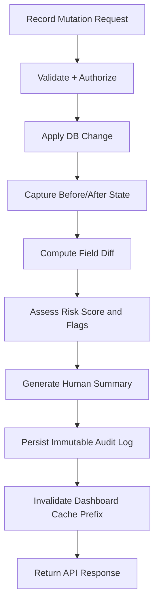

# Finance Dashboard Backend API

A production-minded REST API for finance operations, analytics, and compliance-aware auditing, built with Node.js, Express, and MongoDB.

## Live Deployment

- Base URL: https://finance-data-processing-gvfo.onrender.com
- API Docs: https://finance-data-processing-gvfo.onrender.com/api/docs
- Health Check: https://finance-data-processing-gvfo.onrender.com/health

## What Makes This Assignment Stand Out

This project is not only CRUD.

It implements a Smart Audit Trail system that captures:

- what changed (field-level before/after diff)
- risk level for each action (scored 0-100)
- anomaly flags for suspicious behavior
- human-readable summaries for fast investigation
- immutable logs for tamper-resistant history

## At A Glance

| Area         | Highlights                                                             |
| ------------ | ---------------------------------------------------------------------- |
| Architecture | Layered routes -> controllers -> services -> models                    |
| Security     | JWT auth, role-based access, Helmet, CORS allowlist, rate limits       |
| Compliance   | Immutable audit logs, contextual request metadata, self-audit endpoint |
| Data Safety  | Soft-delete + restore for financial records                            |
| Performance  | Query-aware in-memory dashboard caching with mutation invalidation     |
| Quality      | Jest + Supertest integration and unit test coverage                    |

## Core Flowcharts

### 1) System Request Pipeline

How an incoming request travels through middleware, authorization, business logic, and error handling.



### 2) Authentication and Token Lifecycle

How register/login/logout and revoked token checks are enforced.



### 3) Financial Record Mutation to Audit Trail

How create/update/delete/restore operations produce auditable, risk-scored events and cache invalidation.



## Tech Stack

| Layer     | Technology                       |
| --------- | -------------------------------- |
| Runtime   | Node.js 18+                      |
| Framework | Express.js                       |
| Database  | MongoDB + Mongoose               |
| Auth      | JWT (jsonwebtoken + bcryptjs)    |
| Security  | Helmet, CORS, express-rate-limit |
| Testing   | Jest + Supertest                 |

## Project Structure

```text
finance-backend/
├── src/
│   ├── config/
│   │   ├── db.js
│   │   └── seed.js
│   ├── controllers/
│   ├── lib/
│   │   ├── cache.js
│   │   └── tokenBlacklist.js
│   ├── middleware/
│   ├── models/
│   ├── routes/
│   ├── services/
│   │   └── audit.service.js
│   ├── app.js
│   └── server.js
├── tests/
├── .env.example
├── package.json
└── README.md
```

## Setup and Installation

### Prerequisites

- Node.js 18+
- MongoDB local instance or MongoDB Atlas URI

### Quick Setup

```bash
git clone <your-repo-url>
cd finance-backend
npm install
cp .env.example .env
npm run seed
npm run dev
```

Docs URL after startup (local):

`http://localhost:5000/api/docs`

Docs URL (deployed):

`https://finance-data-processing-gvfo.onrender.com/api/docs`

Note:

- `.env.example` sets `PORT=5000`.
- server fallback is `8000` if `PORT` is not defined.

## Environment Variables

```env
PORT=5000
MONGO_URI=mongodb://localhost:27017/finance_dashboard
JWT_SECRET=your_super_secret_jwt_key_change_in_production
JWT_EXPIRES=7d
NODE_ENV=development
ALLOWED_ORIGINS=http://localhost:3000,http://localhost:5000
CACHE_TTL_SECONDS=120
```

## Demo Credentials (After Seeding)

| Role    | Email               | Password   |
| ------- | ------------------- | ---------- |
| Admin   | admin@finance.com   | admin123   |
| Analyst | analyst@finance.com | analyst123 |
| Viewer  | viewer@finance.com  | viewer123  |

## Assignment Requirement Coverage

| Requirement                   | Status    | Implementation Evidence                                                      |
| ----------------------------- | --------- | ---------------------------------------------------------------------------- |
| User and Role Management      | Fully Met | `/api/users/*` admin routes, role/status updates, role guards                |
| Financial Records Management  | Fully Met | CRUD + filters + pagination + soft-delete/restore in `/api/records/*`        |
| Dashboard Summary APIs        | Fully Met | `/api/dashboard/*` summary, trends, category breakdown, recent activity      |
| Access Control Logic          | Fully Met | `authenticate` + `authorize` middleware and route-level RBAC                 |
| Validation and Error Handling | Fully Met | Input validation middleware, Mongoose validation, centralized error handling |
| Data Persistence              | Fully Met | MongoDB with Mongoose schemas and indexes                                    |

## Smart Audit Trail Details

| Capability       | Implementation                                                                                                                                          |
| ---------------- | ------------------------------------------------------------------------------------------------------------------------------------------------------- |
| Field-level Diff | Stores only changed fields in `before`, `after`, and `changedFields`                                                                                    |
| Risk Scoring     | Heuristic score (0-100), capped at 100                                                                                                                  |
| Risk Levels      | low, medium, high, critical                                                                                                                             |
| Anomaly Flags    | Includes `high_risk_action`, `sensitive_action`, `large_amount`, `significant_amount`, `role_escalation`, `off_hours_activity`, `failed_authentication` |
| Human Summaries  | Action-specific plain-English event summaries                                                                                                           |
| Immutable Logs   | Audit model blocks update operations via schema pre-hook                                                                                                |
| Searchable Tags  | Auto-tagging by action, changed fields, and risk level                                                                                                  |

## API Reference

Full docs endpoint (deployed): `https://finance-data-processing-gvfo.onrender.com/api/docs`

Local docs endpoint: `http://localhost:5000/api/docs`

### Authentication

| Method | Endpoint             | Access        | Description                     |
| ------ | -------------------- | ------------- | ------------------------------- |
| POST   | `/api/auth/register` | Public        | Register as viewer or analyst   |
| POST   | `/api/auth/login`    | Public        | Login and receive JWT           |
| POST   | `/api/auth/logout`   | Authenticated | Logout and revoke current token |
| GET    | `/api/auth/me`       | Authenticated | Get current user                |

### User Management

| Method | Endpoint                | Access | Description              |
| ------ | ----------------------- | ------ | ------------------------ |
| GET    | `/api/users`            | Admin  | List users               |
| POST   | `/api/users`            | Admin  | Create user              |
| GET    | `/api/users/:id`        | Admin  | Get user by ID           |
| PATCH  | `/api/users/:id`        | Admin  | Update user              |
| PATCH  | `/api/users/:id/role`   | Admin  | Change role              |
| PATCH  | `/api/users/:id/status` | Admin  | Activate/deactivate user |
| DELETE | `/api/users/:id`        | Admin  | Delete user              |

### Financial Records

| Method | Endpoint                   | Access   | Description                     |
| ------ | -------------------------- | -------- | ------------------------------- |
| GET    | `/api/records`             | Viewer+  | List records with query filters |
| GET    | `/api/records/:id`         | Viewer+  | Get one record                  |
| POST   | `/api/records`             | Analyst+ | Create record                   |
| PATCH  | `/api/records/:id`         | Analyst+ | Update record                   |
| DELETE | `/api/records/:id`         | Admin    | Soft delete                     |
| PATCH  | `/api/records/:id/restore` | Admin    | Restore soft-deleted record     |

Record query examples:

```text
?type=income|expense
?category=salary|food|transport|...
?startDate=2024-01-01&endDate=2024-12-31
?minAmount=1000&maxAmount=50000
?tags=salary,investment
?page=1&limit=20&sort=-date
```

### Dashboard Analytics

| Method | Endpoint                            | Access   | Description                      |
| ------ | ----------------------------------- | -------- | -------------------------------- |
| GET    | `/api/dashboard/summary`            | Viewer+  | Income, expense, balance summary |
| GET    | `/api/dashboard/category-breakdown` | Viewer+  | Category totals                  |
| GET    | `/api/dashboard/monthly-trends`     | Viewer+  | Monthly trend analytics          |
| GET    | `/api/dashboard/weekly-trends`      | Viewer+  | Weekly trend analytics           |
| GET    | `/api/dashboard/recent-activity`    | Viewer+  | Latest record activity           |
| GET    | `/api/dashboard/top-categories`     | Analyst+ | Top spend categories             |

### Audit APIs

| Method | Endpoint                  | Access        | Description                 |
| ------ | ------------------------- | ------------- | --------------------------- |
| GET    | `/api/audit`              | Admin         | Query logs with filters     |
| GET    | `/api/audit/:id`          | Admin         | Get detailed audit log      |
| GET    | `/api/audit/risk-summary` | Admin         | Risk analytics summary      |
| GET    | `/api/audit/actions`      | Admin         | List supported action types |
| GET    | `/api/audit/my-activity`  | Authenticated | Current user activity feed  |

Audit query examples:

```text
?action=ROLE_CHANGED
?riskLevel=high|critical
?userId=<mongoId>
?startDate=2024-01-01&endDate=2024-12-31
?page=1&limit=20
```

## Role Permissions Matrix

| Action                | Viewer | Analyst | Admin |
| --------------------- | :----: | :-----: | :---: |
| View records          |  Yes   |   Yes   |  Yes  |
| View dashboard        |  Yes   |   Yes   |  Yes  |
| Create records        |   No   |   Yes   |  Yes  |
| Update records        |   No   |   Yes   |  Yes  |
| Delete records (soft) |   No   |   No    |  Yes  |
| Restore records       |   No   |   No    |  Yes  |
| Top categories        |   No   |   Yes   |  Yes  |
| Manage users          |   No   |   No    |  Yes  |
| Change roles          |   No   |   No    |  Yes  |
| View audit logs       |   No   |   No    |  Yes  |
| View own activity     |  Yes   |   Yes   |  Yes  |

## Security Features

- Password hashing with bcryptjs (12 salt rounds)
- JWT-based authentication with configurable expiry
- Immediate logout revocation using token blacklist
- Helmet security headers
- CORS allowlist from environment config
- Global + auth-specific rate limiting
- Validation middleware + model-level validators
- Sensitive field masking in diffs and API output
- Route-level role-based authorization

## Caching Strategy

- Dashboard responses are cached using query-aware keys.
- Default TTL is controlled by `CACHE_TTL_SECONDS` (120 in `.env.example`).
- Record mutations (create, update, delete, restore) invalidate `dashboard:` cache keys.

## Testing

Run tests:

```bash
npm test
```

Current automated coverage includes:

- auth integration tests (register, login, logout revocation, inactive-user checks)
- RBAC integration tests for records routes
- audit service unit tests (diff, risk scoring, summary, tag extraction)

Current gaps to improve next:

- dashboard endpoint integration tests
- audit endpoint integration tests
- broader validation/error-path integration tests

## Design Decisions

### Soft Delete First

Financial records are soft-deleted (`isDeleted`, `deletedAt`, `deletedBy`) to preserve data integrity and support restore operations.

### Immutable Audit Log

Audit logs are write-once by schema policy. Update operations are blocked at model level.

### Explainable Risk Scoring

Risk uses deterministic heuristics (action type, amount, role change, time window, auth failures) for transparent interpretation.

### Stateless Auth with Revocation

JWT remains stateless, while logout revocation is handled via blacklist entries tied to token expiry.

## 10-Minute Evaluator Quickstart

```bash
npm install
cp .env.example .env
npm run seed
npm test
npm run dev
```

Suggested evaluator flow:

1. Login as viewer and verify read-only behavior.
2. Login as analyst and verify create/update access on records.
3. Login as admin and verify delete/restore and user management.
4. Check `/api/audit/my-activity` for self-audit trace.
5. Logout and verify the same token is rejected.

## License

MIT
